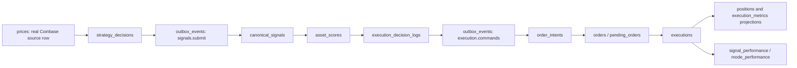
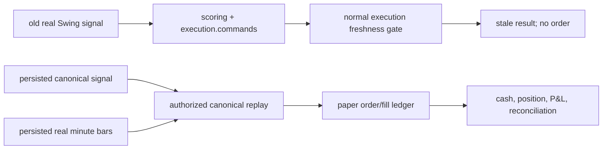

# Production-Equivalent Paper Pipeline Verification

This guide is a local paper verification procedure for the independent vynmatrix
migration. It records requirements, not a completed run or inherited certification.
Use an isolated local database and keep the live gate disabled. No publishing,
deployment, or interaction with an existing personal/live runtime is authorized.

This is the canonical acceptance procedure for the connected runtime:

`real market data -> strategy runtime journal -> signal relay -> scoring ->
binding decision -> transactional outbox -> paper execution -> fill/accounting ->
feedback`

The synchronized portfolio extension is:

`point-in-time panel -> panel decision/rank/state -> model rebalance -> batch
scoring/account plan -> exit/reduce phases -> entry phase ->
fill/accounting/feedback`

The first canary is exactly `SwingHighLowPMO` version `1.1.0` on the top-3
crypto pairs `BTC-USDC`, `ETH-USDC`, and `SOL-USDC`, `coinbase_live`, source
timeframe `1m`, strategy timeframe `15m`, and one dedicated local-paper
account. (The recorded fixed historical witness below predates the universe
expansion and remains a BTC-USDC-only artifact of version `1.0.1`.) This procedure proves platform behavior; it does not optimize or approve
strategy performance.

Use only public or authenticated real Coinbase candles. Never insert a signal,
price, fill, or broker response to make this test pass.

## Safety and scope

- Run from the platform repository root.
- Use only services and images declared in
  `docker/docker-compose.stack.yml` and `config/containers.yaml`.
- Keep `EXECUTION_MODE=paper`, `RUN_MODE=paper`,
  `EXECUTION_ENGINE_ALLOW_LIVE=false`, and
  `EXECUTION_USE_LOCAL_PAPER_BROKER=true`.
- Use a dedicated database and dedicated local-paper broker account. Do not
  point this run at a production database or a real-money broker account.
- Do not put broker secrets in commands, logs, evidence, or source control.
- Do not activate a wildcard binding or a second owner for the canary
  account/instrument.
- Do not edit the promotion manifest by hand.
- Do not select `USQualityCompounder` for this per-symbol crypto canary. It
  remains disabled and uses a separate synchronized-panel proof.
  Historical EODHD or reconstructed-membership evidence cannot be promoted by
  changing a scope label; its prospective exact-owner EODHD/SEC producer must
  instead satisfy its independent paper-forward gates.
- Do not run `sp500-research-import` as a success-path E2E substitute. The
  historical EODHD component reconstruction lacks source publication
  timestamps and is required to fail before DB writes. Historical import uses
  the existing market-data-ingestor image only after a qualified
  content-addressed symbolic evidence bundle exists; the prospective
  `sp500-paper-forward-evidence` command is a distinct exact-owner path.
- Preserve the database and bounded service logs until evidence review
  completes. Teardown must not use `down -v` unless the operator explicitly
  decides to destroy that evidence.

The checked-in Swing config remains development-only and
`READY_FOR_BACKTEST`. A successful local run is necessary but is not sufficient
to authorize a cloud paper deployment.

### Composite proof contract

No fixed historical run is allowed to masquerade as a live end-to-end order.
The evidence is deliberately composite:

1. **Current-time paper soak:** after bootstrap, only newly completed real
   Coinbase bars may produce a signal that traverses strategy journal, both
   outboxes, normal execution freshness checks, and the local-paper broker. This
   is the only path that can prove a current signal creates one economic order.
2. **Normal historical safety:** posting a real but old canonical signal through
   scoring and its outbox must reach the normal execution freshness gate and
   publish a blocked/stale result with no order. Historical catch-up is not
   permission to trade.
3. **Authorized historical paper replay:** the existing
   `scripts/replay_canonical_signals.py` path separately evaluates already
   persisted canonical signals against persisted real candles on one dedicated
   local-paper account. It proves deterministic fill, accounting, P&L,
   reconciliation, and restart behavior; it does not prove current-time
   transport latency or authorize cloud paper trading.
4. **Failure-mode suites:** PostgreSQL integration and service tests prove
   retries, duplicate delivery, DLQ/redrive, authority races, pending-order
   restart, and feedback concurrency when a naturally timed fault cannot be
   forced safely during the soak.

Bootstrap and historical-rebuild emissions are suppressed. Never weaken signal
age, market-data freshness, or current-authority guards to make one historical
run appear end to end.

### Synchronized portfolio proof contract

The portfolio route is not proved by the Swing canary and is not currently
eligible for a real-data E2E run. The account-wide final-target fence is
implemented, but a separately reviewed forward provider and a stack migrated
through `0091` are still required. Its proof must use the same declared Compose
services and add all of the following without weakening the composite contract
above:

1. One registered panel revision contains the complete point-in-time effective
   membership, permanent security/share-class map, official decision and next
   execution sessions, latest cutoff-safe observations, factor snapshots,
   entitlement, provider-policy hash, and explicit exclusions.
2. One transaction completes `strategy_panel_decisions`, rank rows, compatible
   portfolio state, full evaluation audit, stable signal envelopes, and exactly
   one `signals.rebalances.submit` event. Incomplete panels, changed corrections,
   direct unregistered inputs, and conflicting replays create no rebalance.
3. Scoring reconstructs the completed panel and rank hashes, accepts only
   `paper_forward`, evaluates each tenant/user/binding/account boundary, and
   commits the immutable model rebalance, frozen account plan, canonical
   signals/decision logs, and exactly one `execution.rebalance.commands` event
   atomically. Historical-validation and live-forward batches create no plan.
4. Execution generation-fences one lease owner, revalidates current authority,
   and confirms exits/reductions before entries. Partial, ambiguous, stale,
   expired, or unreconciled reductions block dependent entries; duplicate
   delivery and process restart create no duplicate economic order.
5. Canonical fills reconstruct positions, cash, NAV, P&L, and feedback for the
   exact user and broker account. Manual/entry-disabled accounts may reduce only
   with exit authority and can never increase exposure.
6. A deliberately terminal failed plan makes readiness red until an
   admin-authenticated, operator-identified resolution is appended. Exact
   resolution replay creates no duplicate, later remediation evidence appends,
   and neither operation changes the terminal plan.
7. Every exposure increase proves a fresh broker-sourced current-equity
   observation bound to the exact user, internal account, broker-reported
   account reference, and base currency. Peak provenance is the highest
   positive durable exact-account execution metric or, for a connected local
   paper account only, configured `paper_initial_equity`; profile-cache,
   unattributed, mismatched, and live-without-history baselines are rejected.
8. The final full strategy FIFO reread proves every exit is zero, every
   out-of-plan strategy position is absent, and every modeled symbol matches its
   frozen target under an account-wide writer fence. A read followed by an
   unfenced terminal transition is not sufficient E2E evidence.

Preserve database rows and redacted service logs for every accepted, rejected,
retried, and recovered phase. Unit, SQLite, or isolated PostgreSQL contract
tests are prerequisites, not the real-data Docker proof.

## 1. Prepare the exact runtime

Review `CLAUDE.md`, then create an untracked `.env` from `.env.example`. Set a
unique database name and strong local credentials. The relevant non-secret
settings are:

```dotenv
ENVIRONMENT=dev
EXECUTION_MODE=paper
RUN_MODE=paper
EXECUTION_ENGINE_ALLOW_LIVE=false
EXECUTION_USE_LOCAL_PAPER_BROKER=true

INGESTOR_SYMBOLS=BTC-USDC,ETH-USDC,SOL-USDC
INGESTOR_SOURCE=coinbase_live
INGESTOR_GRANULARITY=ONE_MINUTE
INGESTOR_BACKFILL_DAYS=150

STRATEGY_LIST=SwingHighLowPMO
INDICATOR_ALLOW_DEV_DISCOVERY=false

INDICATOR_MAX_SIGNAL_BACKLOG_AGE_SECONDS=300
INDICATOR_MAX_STRATEGY_LAG_SECONDS=300
SCORING_OUTBOX_MAX_AGE_SECONDS=300
EXECUTION_PAPER_ORDER_MAX_LAG_SECONDS=300

DB_POOL_SIZE=3
DB_MAX_OVERFLOW=2
DB_POOL_TIMEOUT_SECONDS=10
DB_POOL_RECYCLE_SECONDS=1800
DB_POOL_CONNECTION_BUDGET=5
```

`150` backfill days is the current warm-up requirement in the production
strategy configuration. The backfill worker is deficit-aware and stores source
provenance; it must not relabel data from another provider as `coinbase_live`.

Build and audit through repository tooling:

```bash
vmdev build libs
vmdev build strategies
vmdev build venvs
vmdev build docker --from-config --tag latest
vmdev audit --strict
vmdev test all
```

Validate the declared Compose model before starting it:

```bash
docker compose \
  --env-file .env \
  -f docker/docker-compose.stack.yml \
  config --quiet
```

Do not replace these commands with ad-hoc `docker run` containers or an
unreviewed single-use topology.

## 2. Migrate, seed, and verify authority

Start the default stack without the indicator worker:

```bash
docker compose \
  --env-file .env \
  -f docker/docker-compose.stack.yml \
  up -d
```

The declared dependency chain runs `db-migrate`, provisions least-privilege
runtime roles, and applies the local development seed before strategy startup.
Confirm every one-shot completed successfully:

```bash
docker compose \
  --env-file .env \
  -f docker/docker-compose.stack.yml \
  ps --all
```

Confirm the database is at the current linear head:

```bash
docker compose \
  --env-file .env \
  -f docker/docker-compose.stack.yml \
  exec -T postgres \
  sh -c 'psql -v ON_ERROR_STOP=1 -U "$POSTGRES_USER" -d "$POSTGRES_DB" -Atc "SELECT version_num FROM alembic_version"'
```

Expected:

```text
0096_model_prior_identity
```

Migration `0078_feedback_exact_lineage` is the required exact-attribution
foundation. Migration `0079_feedback_concurrency_fences` adds feedback-cycle and
strategy-retirement concurrency protection. Migration
`0080_execution_binding_read` lets the least-privilege execution role
revalidate current binding authority. Migration `0081_indicator_source_lock` is
the narrow security-definer source-row lock without granting price mutation.
Migration `0082_execution_replay_read` grants the execution role the catalogue
read required for exact replay recovery. Migration
`0083_paper_fill_projection` checkpoints each delayed paper fill until its
idempotent metric, position, and NAV projections complete. Migration
`0084_equity_reference_data` adds the equity reference tables
(`corporate_actions`, `index_membership`, `earnings_events`) used by the
US-equity research and backfill path; it does not change the crypto canary
chain. Migration `0085_equity_reference_grants` grants the market-data role
write access to `corporate_actions` for the scheduled-daily backfill's
corporate-action loading. Migration `0086_equity_factor_evidence` adds
append-only provider lineage, observation/value, factor/evidence, and rank
ledgers. Migration `0087_synchronized_panel_runtime` adds permanent security
identity, immutable panel-input registration, and the atomic
prepared/completed panel decision journal. Migration
`0088_portfolio_rebalances` adds immutable model rebalances and frozen
tenant/account plans with durable phased execution state and append-only
operator resolutions for terminal failures. Forward-only migration
`0089_account_execution_fence` adds the account-wide execution-generation
ledger, frozen leg targets, terminal generation/digest seal, and strengthened
guards without changing the already-applied `0088` contract. These migrations
do not activate the disabled equity strategy. Migration
`0090_optional_equity_factor_contracts` persists the registered optional-source
contracts, and migration `0091_dated_equity_security_symbols` adds dated
security-symbol identity without weakening the permanent-class boundary.
Migrations `0092`–`0095` add the owner-fenced panel runtime, factor-risk
evidence, backend control plane, and binding-owned gross-exposure limit;
convergent migration `0096_model_prior_identity` repairs any deployed legacy
two-column prior-leg reference to the exact four-column model identity while
remaining a no-op for a fresh migration-built database.

Before starting the worker, verify through the backend control plane and
database evidence that all of these statements are true:

| Object | Required canary value |
|---|---|
| tenant | one individual active user |
| strategy | `swing_high_low_pmo_v1`, exact version `1.1.0` |
| instrument | canonical `BTC-USDC`, `ETH-USDC`, `SOL-USDC`; crypto, tradable |
| feed route | `coinbase_live`, `1m`, consolidated to `15m` |
| broker account | dedicated account, broker `paper`, environment `paper`, connected |
| binding | exact user/account/strategy/instrument; no wildcard |
| execution mode | `spot`, local paper |
| authority | `is_active=true`, `autopilot=true`, `entries_enabled=true`, `exits_enabled=true` |
| ownership | no overlapping active binding on that account and instrument |
| live authority | false |

The development seed may establish identity and control-plane configuration; it
is never evidence for market data, signals, orders, fills, or P&L. In staging or
production, create and change these objects only through the authenticated
backend API. Do not grant authority with direct SQL. Canary entry authority is
bounded to the reviewed run/soak interval: record its activation time and
deactivate all four flags (`is_active`, `autopilot`, `entries_enabled`,
`exits_enabled`) through the backend when the interval ends.

## 3. Ingest real Coinbase history

Run the declared one-shot backfill service:

```bash
docker compose \
  --env-file .env \
  -f docker/docker-compose.stack.yml \
  --profile backfill \
  run --rm --no-deps market-data-backfill
```

This is an invocation of a declared service, not an alternate container
topology. It must exit successfully and persist real one-minute candles for
all three configured pairs with `coinbase_live` provenance.

Verify the persisted series before starting the strategy:

- enough complete source history exists for the 150-day warm-up;
- timestamps are UTC and strictly ordered;
- each accepted row retains source and content revision;
- there is no future-dated row;
- the latest live-feed watermark is within the configured freshness policy;
- consolidation rejects incomplete 15-minute bars rather than filling gaps.

Keep the continuously supervised `market-data-ingestor` healthy after the
backfill. Public Coinbase market data does not require a credential, but a
configured credential must still be resolved from the approved secret backend.

## 4. Start only the Swing canary

Start the profile-gated worker with the exact selector:

```bash
docker compose \
  --env-file .env \
  -f docker/docker-compose.stack.yml \
  --profile indicator \
  up -d indicator-runner
```

The worker must restore or initialize one versioned
`strategy_runtime_states` record. Cold-start warm-up and correction rebuilds
advance model state with emissions suppressed; they are not a source of
tradeable catch-up signals. For each newly completed post-bootstrap strategy bar
it commits, in one database transaction:

1. the next model state and source watermark;
2. one deterministic `strategy_decisions` record;
3. the canonical signal envelope, if the model emitted a signal;
4. one `outbox_events` row on topic `signals.submit`.

`DurableSignalRelay` submits any stored post-bootstrap envelope to scoring and
acknowledges the outbox row only after the downstream response succeeds. A
process exit between commit and acknowledgement may redeliver the same envelope;
it must not create a second canonical signal or second economic action.

## 5. Observe readiness and progress

Static health is insufficient. Keep these progress gates green:

| Service | Readiness requirement |
|---|---|
| market data | real feed watermark is fresh and complete |
| indicator | child healthy; strategy lag and oldest `signals.submit` backlog are each at or below 300 seconds |
| scoring | oldest deliverable outbox event, especially `execution.commands` and `execution.rebalance.commands`, is at or below 300 seconds; no dead letter |
| execution | initial reconciliation complete; no `submission_unknown`; pending-paper watermark present and at or below 300 seconds of committed market time |
| feedback | scheduled evaluation heartbeat advances and the last cycle succeeds |

Query `/ready` and authenticated `/metrics` on the published service ports.
The indicator worker is not exposed to the host; inspect its health through
Compose and its metrics from inside the declared container.

Required progress metrics include:

- `vm_indicator_signal_backlog_oldest_age_seconds`
- `vm_indicator_strategy_lag_seconds`
- `vm_outbox_oldest_age_seconds`
- `vm_database_pool_checked_out`
- `vm_database_pool_overflow`
- `execution_pending_orders_total`
- `execution_pending_order_oldest_age_seconds`
- `execution_paper_order_processing_lag_seconds`
- `execution_reconciliation_initial_complete`
- `execution_reconciliation_discovered_partitions`

Any readiness regression, pool-budget breach, nonzero dead-letter count, or
unknown broker submission stops the run and blocks promotion.

## 6. Prove the composite persistence chains

Use the database as the primary audit record and logs/metrics as supporting
evidence. A naturally emitted current-time Swing signal may prove the complete
normal chain:



The fixed historical witness must instead prove two explicitly separate
outcomes:



The authorized replay must use:

- one existing connected account whose broker and environment are both paper;
- exactly one active user/account/strategy binding with a non-empty canonical
  instrument scope and all four authority flags true only for the bounded replay
  interval;
- no broker credential row on that local-paper account;
- exact half-open date bounds, source `coinbase_live`, timeframe `15m`, and
  required underlying real `1m` candles;
- the production `ExecutionEngine`, canonical stores, position/accounting
  projections, and `SqlPriceQuoteProvider`, never fabricated fills.
- exactly one executable v1 decision for the canonical signal and requested
  user/account plus its exact already-published `execution.commands` event;
- the persisted event's stable dedup key, score context, policy/config, route,
  binding, account, instrument, action, and strategy as economic authority.
  Only the current linked-account snapshot supplies current authorization and
  ledger capital.

The reviewed fixed Swing witness is the half-open real Coinbase window
`2026-07-10T00:00:00Z` through `2026-07-16T00:00:00Z`. It emits LONG at
`2026-07-14T11:00:00Z` and CLOSE at `2026-07-14T12:45:00Z`. The PostgreSQL
pipeline gate first proves that ordinary scoring/outbox delivery of these old
commands publishes a blocked/stale result and creates no order. Once those
canonical signals and exact source candles exist, the separate replay is:

```bash
docker compose \
  --env-file .env \
  -f docker/docker-compose.stack.yml \
  run --rm --no-deps execution-engine \
  python /app/scripts/replay_canonical_signals.py \
  --user-id <canary-user-id> \
  --broker-account-id <dedicated-paper-account-id> \
  --strategy-id swing_high_low_pmo_v1 \
  --symbols BTC-USDC \
  --start-date 2026-07-10 \
  --end-date 2026-07-16 \
  --timeframe 15m \
  --source coinbase_live \
  --require-minute-data \
  --no-enable-shorting
```

Use resolved control-plane IDs; do not assume an account ID. The replay refuses
foreign, credential-bearing, unbounded, inactive, or partially authorized
routes. It also refuses missing, ambiguous, unpublished, or lineage-conflicting
decision/command rows. Historical allowance is internal to this local-paper
replay path; normal execution freshness is never relaxed.

The restart witness uses these real-data boundaries:

| Stage | Half-open UTC window | Expected fact |
|---|---|---|
| bootstrap | `2026-07-10T00:00` to `2026-07-14T10:45` | state warms; no historical entry |
| incremental witness | `2026-07-14T10:45` to `11:00` | core emits natural LONG at `11:00`; normal wall-clock execution still rejects it as old |
| replay reference | `11:00` to `11:16` | entry and exact command/fill provenance established |
| protective pre-trigger | `11:16` to `12:30` | protective order remains durable across restart |
| target trigger | `12:30` to `12:31` | first real minute crossing resolves the target |
| remaining | `12:31` to `2026-07-16T00:00` | natural CLOSE is observed at `12:45`; no duplicate economics |

Across the live-soak and historical-replay evidence, show:

- exact strategy ID and version, canonical instrument, source price ID, source
  content revision, source name/timeframe, original UTC bar timestamp, and
  stable signal ID;
- one canonical signal for the deterministic external identity;
- one binding decision for the exact user and broker account;
- one execution-command event for the decision;
- a normal stale historical command produces no canonical order or fill;
- one stable client order ID per account;
- no duplicate canonical order or execution under relay retry;
- every local-paper fill references the exact committed source bar and
  `ohlc-conservative-v1`;
- order, fill, position, cash, P&L, and feedback retain account and currency
  provenance;
- feedback uses exact canonical-signal, decision, order, and fill lineage;
- signal performance is unique by signal and evaluation horizon;
- mode performance is unique within the exact account/strategy/scope/mode/horizon.

`positions` and `execution_metrics` are projections. The canonical execution
ledger, not those projections, is the restart-accounting input.

## 7. Prove durable paper-order behavior

Do not accept immediate close-price fills for stop, stop-limit, limit,
protective, or OCO orders. The local-paper lifecycle must:

- persist intent before acknowledgement;
- retain trigger, limit, purpose, time-in-force, reduce-only, parent, OCO group,
  cumulative quantity, and source watermark;
- evaluate only later committed real bars;
- apply gap-aware, adverse same-bar ordering under
  `ohlc-conservative-v1`;
- fill an OCO sibling at most once and cancel the other sibling durably;
- resume pending work after restart from the database;
- refuse missing, stale, future, revised-out-of-order, or unverifiable source
  bars;
- commit fill, accounting, execution result, and reconciliation state
  atomically or idempotently.

When a current-time entry or the explicitly authorized historical replay creates
protective orders, restart the execution engine before a later committed real
bar resolves them:

```bash
docker compose \
  --env-file .env \
  -f docker/docker-compose.stack.yml \
  restart execution-engine
```

After restart, the same client IDs and cumulative quantities must remain.
Exactly one valid lifecycle transition may result from each new committed bar.

## 8. Prove restart and at-least-once safety

Run each fault test only while the canary remains local paper. Do not create a
fake signal to force timing.

### Strategy restart

Restart `indicator-runner` after it has persisted a non-empty model state:

```bash
docker compose \
  --env-file .env \
  -f docker/docker-compose.stack.yml \
  --profile indicator \
  restart indicator-runner
```

Acceptance:

- generation advances;
- exact model state and raw source watermark restore;
- already committed bar decisions are not recomputed as new decisions;
- an unacknowledged `signals.submit` event is retried with the same identity;
- no duplicate signal or order appears.

### Service transport retry

During a window in which a current-time real signal is possible, stop the
downstream execution service long enough for the execution-command relay to
record a failed attempt, then start it again:

```bash
docker compose \
  --env-file .env \
  -f docker/docker-compose.stack.yml \
  stop execution-engine

docker compose \
  --env-file .env \
  -f docker/docker-compose.stack.yml \
  start execution-engine
```

Acceptance:

- the outbox row retains its event ID and expected generation;
- retry count/backoff changes without creating another business event;
- a still-current, authorized signal dispatches at most one economic order;
- a historical or now-stale signal is rejected by the normal freshness gate and
  creates no order;
- exhaustion moves the original event to the DLQ instead of dropping it.

If no current-time real signal occurs during the bounded soak, record the
economic-order branch as not exercised. Use the fixed real-history replay only
for the separate historical-safety and paper-accounting proofs. Do not inject a
signal or weaken freshness.

### Feedback overlap and restart

Allow the scheduled feedback worker to evaluate an eligible horizon. Restart it
and, in a controlled test run, allow two workers to contend for the same
horizon.

Acceptance:

- one complete evaluation cycle per horizon is serialized by a PostgreSQL
  advisory transaction lock;
- different horizons may proceed concurrently;
- pending work order is deterministic by signal timestamp and signal ID;
- duplicate, restarted, or late older signals cannot move the
  consecutive-wrong tracker backward;
- strategy/version retirement cannot overtake suggestion persistence;
- no duplicate performance row, counter increment, or suggestion appears.

## 9. Prove authority revocation and reconciliation

Change authority only through the authenticated backend API.

Test these current-state transitions:

| State | Expected behavior |
|---|---|
| active + autopilot + entries + exits | new entry and close are eligible |
| active + entries false + exits true | no new exposure; risk-reducing close remains eligible |
| inactive, account disconnected, credential disabled, or route no longer exact | no broker I/O |
| environment mismatch | no broker I/O |

Execution must re-read the current user, binding, account, credential,
environment, and exact instrument route immediately before broker I/O. A stale
scoring decision is not authority.

On every execution-engine restart, discovered
`(user, account, broker, environment)` partitions must reconcile before entry
readiness. Compare internal orders, executions, positions, cash, and open paper
orders with the broker/account ledger. An unresolved broker submission remains
`submission_unknown`; never reset it to retryable `pending`.

The admin DLQ is an exceptional recovery surface:

- inspect with `GET /admin/outbox/dead-letters`;
- redrive with `POST /admin/outbox/dead-letters/{event_id}/redrive`;
- authenticate with the admin API key;
- provide a non-empty `X-Operator-ID`;
- provide a reason and the observed `expected_generation`.

Redrive must be audited and generation-fenced. It reuses the original business
identity and cannot bypass current execution authority.

## 10. Reconcile P&L and feedback

For every filled entry/exit pair, independently reconcile:

- signed quantity and average entry price;
- commissions and slippage;
- realized and unrealized P&L;
- cash and equity in the account base currency;
- point-in-time FX observations and conversion path;
- FIFO lot consumption for spot;
- position and execution-metric projections against the canonical ledger.

Missing FX provenance fails closed. USD/USDC parity must not be assumed.

Feedback may evaluate a signal only after its configured horizon has complete
real market data. Executed outcomes must be attributed through the exact
account-scoped decision/order/fill lineage. Non-executed signals may still be
evaluated for signal quality, but they must never be mislabeled as an executed
trade outcome.

## 11. Evidence and promotion decision

Keep one immutable evidence set for the exact image/config/account/route:

- `account-binding.json`
- `current-authorization.json`
- `durable-model-restart.json`
- `paper-order-restart.json`
- `real-market-data.json`
- `reconciliation.json`
- `scoring-inputs.json`
- `service-transport-restart.json`
- `soak-acceptance.json`

Evidence must contain identifiers, timestamps, hashes, row relationships,
readiness/metric observations, and redacted logs. It must not contain broker or
database secrets.

The canary passes only when:

1. all build, audit, test, migration, and declared-Compose checks pass;
2. the composite real-data evidence is attributable and duplicate-free, with
   old signals rejected by normal execution and replay economics kept separate;
3. strategy, relay, execution, paper-order, reconciliation, and feedback
   restart tests pass;
4. readiness remains green and all four progress SLOs stay within 300 seconds;
5. P&L and FX reconcile to the canonical ledger;
6. there are no unresolved submissions, dead letters, ownership conflicts, or
   unauthorized broker calls;
7. a separately reviewed, strategy-specific bounded soak window passes; the
   [readiness inventory](STRATEGY_READINESS.md) supplies no inherited approval.

Only then write the evidence-hashed, operator-attributed promotion manifest using the existing
`scripts/write_paper_promotion_manifest.py` command described in
[the script reference](../scripts/README.md#write_paper_promotion_manifestpy),
with the exact arguments reviewed for that candidate. Any image, configuration, binding, account, route,
or evidence change invalidates the manifest and requires a new run.

Any successor canary may take over only after Swing is explicitly retired
from the same account/instrument ownership boundary; strategies never
overlap on one canary account/instrument.

## 12. Teardown

First revoke canary authority through the authenticated backend API and prove
all four binding flags are false. Record the end of the bounded authority
window. Then stop the declared stack without deleting the evidence volume:

```bash
docker compose \
  --env-file .env \
  -f docker/docker-compose.stack.yml \
  down
```

Archive the redacted evidence outside the repository only after review. Volume
deletion is a separate, explicit operator decision.
