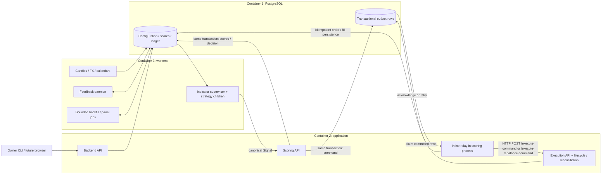
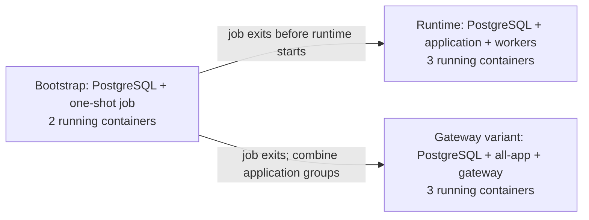

# Single-owner platform: design and implementation plan

**Status:** Reviewed design; implementation is in the working tree. Builds, PostgreSQL
bootstrap/configuration and recorded-data pipeline checks, backup/restore, and both
runtime layouts pass. [MIGRATION.md](MIGRATION.md) records the evidence and the separate
current-time Swing proof that remains unestablished.
**Baseline:** 2026-09-05.

**Goal:** Convert vynmatrix into a self-hosted platform for one individual per
deployment, with multiple brokers, accounts, regions, currencies, and strategies,
using at most three running containers including PostgreSQL.

**Architecture:** Preserve the database-backed trading pipeline and account
authority. Replace tenant selection and commercial provisioning with one explicit
deployment owner. Package existing applications as supervised process groups.

**Technology:** Existing Python 3.11, SQLAlchemy, PostgreSQL 16, Alembic, FastAPI,
Docker Compose, and `vmdev`; dependency versions remain governed by
`docker/constraints.txt` and component metadata.

This document records the approved design and its current working-tree implementation.
Code and focused tests exist; each PostgreSQL, image, and recorded-data acceptance
claim still requires its own recorded result. Reviewed changes and the existing
verification record carry that evidence.
The operating contracts are maintained in the existing manuals, particularly
[DATABASE.md](DATABASE.md) and [DEPLOYMENT.md](DEPLOYMENT.md). The historical migration, sanitisation,
and verification record remains in [MIGRATION.md](MIGRATION.md).
This plan does not authorize provisioning, deployment, image publication, or live
trading. Repository source terms are recorded in [LICENSE](../LICENSE) and
[NOTICE](../NOTICE).

Contents: [constraints and terms](#1-constraints-and-assumptions) ·
[evidence and topology](#2-verified-starting-point) ·
[owner authority](#3-owner-and-authority-design) ·
[bootstrap and configuration](#4-bootstrap-and-configuration-lifecycle) ·
[deployment](#5-runtime-deployment-design) · [future UI](#6-backend-boundary-for-a-future-ui) ·
[implementation](#7-ordered-implementation-work) · [acceptance](#8-acceptance-matrix-and-checks) ·
[documentation/publication](#9-documentation-and-publication-alignment) ·
[owner decisions](#10-owner-decisions-and-deferred-work).

## 1. Constraints and assumptions

Three containers is the owner's explicit deployment limit, not a measured cost
or capacity optimum; raising it requires an owner-approved scope change supported
by a mandatory dependency or measured resource/failure-isolation needs.

- Keep `EXECUTION_MODE=paper` and `EXECUTION_ENGINE_ALLOW_LIVE=false`.
- Preserve canonical `Signal`/`SignalAction`, action normalization, transactional
  outbox delivery, idempotent execution, and execution-ledger restart accounting.
- Retain explicit owner, binding, broker account, environment, instrument,
  broker-observed contract multiplier, currency/FX, and market-session authority.
  Missing, stale, mismatched, or ambiguous authority fails closed.
- Cash indices remain non-tradable. Registration, installation, and healthy
  processes do not grant strategy or broker execution authority.
- The owner has confirmed that no existing deployment database or data is in use
  and authorized retirement of unused tables/data if a migration requires it.
  That authorization is limited to the declared migration target; future upgrades
  still require explicit backup, migration, and recovery handling.
- Use recorded real history for pipeline evidence; deterministic unit inputs
  remain valid only at unit boundaries.
- Use conventional commits and the existing review process. Do not introduce a
  second specification system, configuration service, message broker, or UI stack.
- This migration has no in-use deployment database. Treat any other database as
  potentially valuable until its owner explicitly authorizes destructive work.
  Initially assume private cloud access over SSH forwarding; public HTTPS is a
  separate decision.
- One host is sufficient for the initial deployment. This design provides no
  high availability and makes no unmeasured RAM, throughput, or cloud-cost claim.

Terms used below:

- **Owner:** the individual operating this installation.
- **Deployment owner:** that individual's sole designated `User` row in this database.
- **Designated owner:** a synonym for deployment owner, not a separate role or identity.
- **Entitlement owner:** the persisted identity authorized to use particular data;
  it must match where required and is never inferred or rewritten during adoption.

## 2. Verified starting point

The original inspection found commercial user provisioning, broad SQL seed paths,
and seven default containers (eight with indicators, thirteen with optional services).
Those are the baseline for the changes below. Prior `vmdev` results in
[MIGRATION.md](MIGRATION.md) remain reported context, not new integration evidence.

- **Identity:** [identity.py](../libs/python/lib_application/lib_application/db/models/identity.py)
  now retains `User.user_id` and an explicit owner marker. Commercial structures
  are retired through guarded
  [0103](../scripts/db/alembic/versions/0103_remove_commercial_tenancy.py).
- **Lifecycle:** [user.py](../tools/dev_cli/dev_cli/commands/user.py) delegates to
  [owner_onboarding.py](../libs/python/lib_application/lib_application/services/owner_onboarding.py)
  and [account_onboarding.py](../libs/python/lib_application/lib_application/services/account_onboarding.py).
  Account IDs, atomic encrypted credentials and expected-value updates are preserved.
- **Permissions:** [session.py](../libs/python/lib_application/lib_application/db/session.py)
  retains `tenant_scope`; [0052](../scripts/db/alembic/versions/0052_service_role_rls.py)
  remains the historical service matrix. `0099`–`0102` append discovery, catalogue
  grants, owner-restrictive backend policies and guarded account/profile writes.
- **Routing:** [storage.py](../apps/scoring_engine/scoring_engine/storage.py)
  (`AppScoreStore.list_bindings`) filters the designated owner and refreshes binding
  cache authority. [execution_routing.py][execution-routing] rechecks the owner,
  exact active strategy version and concrete account immediately before new orders.
  [canonical_execution_store.py][canonical-execution-store] retains ledger identity.
- **References:** [catalogue.py](../libs/python/lib_application/lib_application/services/catalogue.py)
  registers missing records without activation or commit ownership. The source
  broker/instrument files replace installation-time SQL fixtures; historical fixture
  SQL remains excluded from bootstrap and is not evidence of market activity.
- **Bootstrap:** [db.py](../tools/dev_cli/dev_cli/commands/db.py) owns the CLI;
  [bootstrap.py](../tools/dev_cli/dev_cli/core/bootstrap.py) separates provisioning,
  migration, reference registration and owner initialization. Legacy reset/seed
  helpers and the extra Compose stack are retired.
- **Topology:** [stack Compose](../docker/docker-compose.stack.yml) declares
  PostgreSQL, application, workers and an explicit maintenance job. The
  [lifecycle](../tools/dev_cli/dev_cli/core/database_lifecycle.py) stops runtime
  groups and verifies the available slot before running maintenance.
- **Acceptance:** the head is `0104_saxo_capability_flags`. Fresh/repeated
  PostgreSQL bootstrap, focused owner/catalogue/migration checks, zero schema
  drift, and the platform image build have recorded results. Remaining pipeline
  and connected-runtime checks remain separate; see [MIGRATION.md](MIGRATION.md).

### 2.1 Target topology

The steady-state diagram shows three containers. Scoring commits a decision and
its outbox row in PostgreSQL; the inline relay claims committed rows and sends an
HTTP POST to execution. This is the existing
[`OutboxRelayWorker._deliver_execution_command`][outbox-relay]
boundary, not an in-memory scoring-to-execution handoff.



Bootstrap uses a temporary application-image job, never a fourth steady-state
container. The second diagram shows the slot transition:



Text equivalent: PostgreSQL persists configuration, scores, outbox and ledger.
The application group serves backend/scoring/execution; workers produce data
and signals and run feedback/jobs. Bootstrap holds one temporary slot and exits
before runtime groups start. Privileged maintenance first stops both runtime
groups; bounded runtime jobs use an existing container.
[Section 5](#5-runtime-deployment-design) maps every existing
process and describes the two-container alternative.

## 3. Owner and authority design

### 3.1 Keep, remove, and consolidate

- **Keep trading identity and configuration:** `User`, `LinkedBrokerAccount`,
  `BrokerCredential`, `UserStrategyBinding`, risk mandates, sizing profiles,
  `UserStrategyConfig`, and `UserTradingPolicy`. Preserve IDs, composite ownership
  constraints, currencies, status and audit. `DBProfileProvider._resolve_risk_profile`
  still reads trading policy.
- **Remove commercial provisioning:** organization choice, plans/subscriptions,
  and admin/trader/viewer/support selection. Update `vmdev user`, ORM relationships
  and profile serialization before guarded schema retirement.
- **Conditionally retire unused metadata:** consent/suitability and commercial
  feature flags. Check ORM, SQL, migrations, scripts and tests for consumers;
  populated records require explicit archival/disposition before removal.
- **Consolidate owner selection and writes:** use owner-relative routes, shared
  CLI/API application services and one reference source per configuration category.
- **Keep existing access boundaries:** `tenant_scope`, account ownership checks,
  and six least-privilege service groups. Supply only the resolved owner; retain
  separate migration and runtime identities.

Add `User.is_deployment_owner`, default false, with a partial unique index over
true values. Exactly one active designated owner is required for executable
worker startup and new work; management API health remains independent.
Uniqueness alone cannot enforce existence. Initialization explicitly creates or
adopts that owner. An email, the first row, a broker code, or an environment
variable supplied with a request is never an owner-selection heuristic.

The backend discovers the owner before setting tenant scope through the narrowly
granted database function
`vm_deployment_owner_id()` returning only the active designated owner's ID.
It is `SECURITY DEFINER` with fixed, schema-qualified SQL and a locked search path;
`PUBLIC` execute is revoked and only reviewed service groups receive grants.
Only migration/onboarding authority may change the marker. The application service,
`lib_application.services.deployment_owner.require_deployment_owner_id(session)`,
uses that function and raises a useful error for missing/inactive ownership.
Use direct model lookup only in isolated SQLite unit stores.

Replace `/users/{user_id}/...` with owner-relative routes such as `/owner`,
`/bindings`, `/strategy-configs`, and `/broker-accounts`. Reject caller-supplied
owner identity in routine API/CLI operations. The sole selection exception is
bootstrap adoption through `vmdev user init --existing-user-id`, executed with
migration/onboarding authority; it may name an existing owner but never reassign
that user's historical records. Remove old routes after checking real CLI and
documented consumers; do not add aliases without an identified external consumer.

Owner-bound producers, binding caches, account enumeration, execution commands,
feedback review and panel jobs must resolve/check the same owner. Preserve
`PanelRuntimeBinding.entitlement_owner_user_id`, its digest, runtime partitions,
and data-use entitlement checks. Shared market observations remain shared
reference records; they are not transformed into owner-specific duplicates.
Filter `AppScoreStore.list_bindings` and invalidate its cache on relevant changes;
recheck designated ownership in `ExecutionRouteResolver` before order I/O.
Reject mismatched promotion manifests and panel evidence rather than relabel
their entitlement owner or regenerate their identity to force a match.

Existing non-owner records remain historically attributable. Adoption refuses
to activate the new runtime while another owner has unresolved orders, account
work, or positions requiring management. Resolve that disposition explicitly;
do not hide it by filtering it out or setting users inactive.

### 3.2 Contracts and access controls

Keep `ExecutionCommandEvent.user_id`, `BrokerRouteSnapshot`, binding/account
identities, outbox keys, fill-time FX, and the three boundary-specific
`OrderIntent` types. Keep accounting replay available for historical inactive or
retired strategies. Active-version gates authorize new work, not deletion or
reinterpretation of already recorded executions.

Remove `org_id` from new profile context only after tracing its consumers. Old
stored snapshots remain readable. If any durable event field must change, add
an explicit schema version and producer/consumer handling before draining or
replaying old events; no blind replacement of queued JSON.

Backend authentication remains mandatory even on loopback. Disable the Compose
anonymous-access default; preserve separate owner administration and internal
service keys. A future browser must use an owner-authenticated server session
with secure cookies and CSRF protection, not a bundled backend admin key.
Internal trading endpoints and PostgreSQL are not public UI endpoints.

## 4. Bootstrap and configuration lifecycle

### 4.1 CLI surface

The implementation extends the existing `vmdev` groups; `vmdev strategy` remains the historical campaign
validation/attestation interface.

Use **catalogue** consistently in prose and commands, following existing
symbols such as `check_broker_capability_catalogue` in the `vmdev` audit code.
Existing repository paths and symbols retain their actual spelling.

| Command | Purpose |
| --- | --- |
| `vmdev db bootstrap --owner-config PATH` | Resumable installation from reviewed owner input; no reset |
| `vmdev db catalogue --check` | Validate and display differences |
| `vmdev db catalogue --apply` | Create missing reviewed references |
| `vmdev db catalogue --apply --changes PATH` | Apply an expected-value patch |
| `vmdev user init` | Create or explicitly adopt the owner |
| `vmdev user show` | Read the designated owner without an ID selector |
| `vmdev user update --config PATH` | Apply expected-value profile changes |
| `vmdev user account --config PATH` | Add, adopt or update an account by stable key |
| `vmdev db activate-canary --strategy-id ID --version SEMVER` | Activate only an eligible development pipeline canary |

Catalogue apply rejects unrequested changes to existing rows. Source reconciliation
may be restricted with `--strategy-id ID` or `--broker-code CODE`; an explicit
`--changes` patch cannot combine with those selectors. Owner initialization supports
`--existing-user-id` and returns the same owner on an identical retry. Omitted
profile fields remain unchanged. Account operations use the backend onboarding
services; secret values arrive through protected inputs, never command arguments.

Do not create a generic synchronization framework. Add small typed catalogue and
onboarding services under `lib_application.services`, extract the relevant
backend operations into them, and keep Click/HTTP code as adapters. CLI writes
use the same authorization, validation, audit, and transaction boundaries as
their corresponding backend operation, not unrestricted direct SQL.

**CLI credentials and roles.** The CLI requires stage-specific URLs, verifies
the connected role, and disposes connections after each operation. Generic
`DATABASE_URL` is not a fallback:

- `db bootstrap` uses the explicit maintenance administrator for database creation
  and complete historical Alembic execution. `0052` includes `ALTER ROLE ...
  NOSUPERUSER`, which PostgreSQL requires a superuser to execute even when removing
  privilege. The normal administrator and migration URLs use the same verified
  login/password with different databases; connections and commit stages remain
  separate. A distinct privileged migration login must be explicitly preprovisioned.
  Do not invent/elevate a maintenance identity or rewrite migration history.
- Initial reference loading, `user init`/adoption and `db activate-canary` use
  `MIGRATION_DATABASE_URL` with verified maintenance authority in
  separate transactions. Runtime has no user creation or owner-marker permission.
- Routine `db catalogue`, `user show`, `user update`, and `user account` use
  `BACKEND_DATABASE_URL`, exactly `vm_backend_login` with only `vm_backend`
  membership. Never fall back to a generic URL or maintenance credentials.

Fixed create/patch functions, owner discovery, narrow column grants and restrictive
policies are appended by `0099`–`0102`. Their `PUBLIC` execute grants are revoked;
search paths and table/function identifiers are fixed. Mutable metadata updates
use expected-value patches; instrument financial/session authority is immutable.
The exact command and input contracts are canonical in [DATABASE.md](DATABASE.md).

Profile grants exclude identity, designation and status changes; account grants
exclude reassignment. Expected-value edits and encrypted secret writes remain
atomic with their audit. Protected credential files require Unix owner-only,
no-symlink checks. Platforms without those APIs refuse file input and support
`--secrets-file -` with protected redirected stdin instead.

### 4.2 Fresh installation sequence

1. Validate the declared Compose profile, database target, required secret
   references, role names and paper/live flags before side effects. Generate
   local application/database secrets only through an explicit secure setup
   operation; require real owner/broker information rather than inventing it.
2. Start only PostgreSQL. With separate administrator authority, verify the supplied maintenance identity and create or
   verify its target database. Verify ownership/settings
   on rerun; never rotate passwords or adopt a different database implicitly.
   Identical bootstrap retries preserve passwords; explicit rotation uses
   `vmdev db roles --rotate`. Conflicting installed authority is never silently repaired.
3. Acquire a database migration lock and run Alembic to head. Verify the revision
   and required database objects, including triggers, functions and grants.
   Bootstrap then provisions runtime logins through the shared runtime-role
   service after the service-group migrations. The retained
   `docker/provision-runtime-roles.sh` wrapper delegates explicit operations to
   `vmdev db roles`. Preserve one matching service group per login.
4. Reconcile validated static references in a separate transaction. Exclude
   `03_e2e_test_user.sql` and demo-account portions of `04_paper_users.sql` from
   installation. Historical strategy-retirement migrations remain authoritative.
5. Create/adopt the owner transactionally. Account onboarding is a separate
   optional stage: explicit broker, supported environment/region, external
   account identity where required, currency, credentials, and paper capital.
6. Exit the bootstrap job, then start the application and worker groups.
   Application health can succeed with no selected strategies. Mark trading
   readiness unconfigured; do not start an empty indicator supervisor merely
   to make the process inventory look complete.

Run bootstrap stages sequentially with only PostgreSQL and one declared
application one-shot container. Stop it before starting both runtime groups.
Bounded runtime jobs use `exec`; privileged maintenance stops both runtime groups first. A
fourth backup, seed, migration, or pgAdmin container violates the limit.

`CREATE DATABASE` is outside the schema transaction; Alembic, static data, and
owner onboarding have separate commits and resumable checks. This follows
[PostgreSQL's database-creation constraint][postgres-create-database] and
[Alembic's distinction between schema and data migration][alembic-data-migrations].

### 4.3 Configuration ownership and update rules

- **Strategy releases:** existing `config.json`, the indicator JSON schema and
  current loaders/normalizers. Keys are `strategy_id` and `(strategy_id, semver)`.
  Preserve `strat_ver_id`; conflicting parameters/schema/provenance under the same
  version are errors.
- **Instruments:** `config/instruments.yaml` and existing typed services.
  Match canonical asset class/instrument identity and explicit broker contracts.
  Use `lib_application.services.catalogue.upsert_instruments`; replace symbol-only matching
  and reject ambiguous aliases or changed financial contract terms.
- **Brokers:** `config/brokers.yaml`, extracted from current reference SQL.
  Keys are broker code and supported environment/region. Validate implemented
  adapters; metadata cannot create a missing broker capability.
- **Owner settings:** database owner/account/binding/configuration rows and their
  existing IDs. Add unique `(user_id, config_key)` for account adoption. Preserve
  currency, capital, credentials, activation and risk settings on catalogue reruns.
- **Process settings:** environment and existing deployment files, with explicit
  process/strategy/provider selection. Preserve validated precedence and restart
  semantics; image inventory does not own trading policy.

`config/brokers.yaml` replaces current broker reference duplication, not a second
editable catalogue. SQL demo fixtures remain test-only. Preserve required
retirement data migrations. Official session observations, current FX, provider
entitlements, account mappings and credentials are not fabricated static seeds.

New `Strategy` rows are inactive (`Strategy.is_active=false`). The
`ck_version_status` constraint in
`libs/python/lib_application/lib_application/db/models/strategies.py` permits `active`,
`deprecated`, `pulled`, and non-executable `registered`; preserve those values and history.
Every new-work consumer must positively require `active`. Registering a newer
version of an already active strategy must not make the new release executable.
The implemented exception is `vmdev db activate-canary`: maintenance authority
and a designated active owner may activate an existing exact release only when
packaged source has `metadata.decision=E2E_PIPELINE_CANARY_ONLY`, `enabled=true`,
and environments exactly `["dev"]`. Actual environment must be dev (`ENV` and
`ENVIRONMENT` must agree when both are present), with explicit paper mode and
live gate false. Source version, default parameters and schema must match the
registered release. The catalogue lock and fresh row locks protect one audited
transaction; identical active retries are no-ops. Pulled/deprecated releases,
disabled source (including USQualityCompounder), and disabled parents of active
releases cannot be reactivated. This authorizes development pipeline testing
only, creates/enables no bindings/accounts/configurations, changes no
`STRATEGY_LIST`, and issues no promotion manifest or attestation. Generic
strategy activation, certification and promotion remain deferred.
Bindings continue to default inactive, with autopilot and entry/exit authority off.

Reconciliation behavior is deterministic:

```text
validate complete input, supported capabilities and immutable release identity
resolve stable keys; reject ambiguous adoption or duplicate source keys
begin transaction; acquire catalogue advisory lock
re-read current rows; check expected values for every explicit patch
create missing records using database-assigned IDs
apply only explicitly requested, permitted changes; append audit in transaction
commit; return counts and stable IDs without credentials or secret values
```

Absent fields mean preserve; absent records do not mean delete. Routine apply
preserves `deprecated`, `pulled`, and `registered` version statuses, inactive
strategies/bindings, and user configuration. Strategy retirement remains an
operation, not an additional version status.
Account identity, currency or opening capital cannot be rewritten once ledger
or in-flight activity exists. A different account is explicitly onboarded.

Use bounded backoff for transient connection/serialization failures. On unknown
commit outcome, re-read by stable keys before retry. Constraint/input conflicts
are not retried. Onboarding keeps account, credential pointer, ciphertext and
audit in one transaction, extending the existing `set_secret(..., session=s)`
pattern. Catalogue comparison/audit never emits secrets.

The extracted instrument loader leaves commit ownership to its caller, preserves
installed authority and hierarchy, and rejects conflicting source definitions.
No normal update runs `production_seed_guard.sql` or demonstration seeds. The
explicit historical strategy-retirement migrations remain intact; a pulled release
is never weakened during registration.

### 4.4 Existing databases and rollback

Preflight the exact database and Alembic revision; identify owner candidates,
account/binding IDs, pending and dead-letter outbox rows, rebalances, orders,
fills, canonical-ledger exposure and entitlement-bound data. Record counts/checksums without
secrets outside tracked source. Rehearse backup/restore before destructive DDL. `0103` refuses populated commercial
tables or non-null organization links before DDL; it never exports or deletes them automatically.

Revisions `0099`–`0104` append the conversion after `0098`; future changes append
after the actual installed head rather than editing applied history. Owner and
account keys retain their existing identifiers. Adoption refuses foreign pending
orders/rebalances/outbox work and canonical-ledger SPOT exposure; ambiguous
fill identity or foreign non-SPOT history requires explicit reconciliation or
disposition. Position projections cannot establish that another owner is flat.
Inactive historical owners and their records remain intact.

Retire SaaS schema only after consumer removal and explicit archival/disposition
of populated metadata. Reuse the fail-before-DDL approach in
`0055_retire_dormant_schema.py`, without `CASCADE`. Preserve applied revision
history, sequences, foreign keys, triggers, grants and ledger attribution.

Prefer forward correction. Additive changes may allow the previous image;
destructive retirement or a new status value may not. A downgrade must either
preserve all relevant data or refuse with recovery instructions. Existing
`0099` refuses downgrade with a designated owner or populated account keys;
`0097` refuses loss of configured risk data, and `0098` deliberately
does not reactivate a retired strategy on downgrade. Never restore a stale
backup over subsequent executions: reconcile durable/broker state before any
recovery that could replay submitted work.

## 5. Runtime deployment design

See [the topology and bootstrap slot diagrams](#21-target-topology) for the
container layout and durable delivery path. Existing services map as follows:

- **Database:** PostgreSQL and its persistent named volume.
- **Application:** backend, scoring and execution retain separate interpreters,
  ports, DB credentials, FastAPI lifespans and execution background tasks.
  Consolidate the standalone relay into scoring's inline relay.
- **Workers:** retain `IndicatorRunner` and selected strategy children. Supervise
  primary/equity candles, FX and selected IBKR/Saxo/Zerodha calendar writers as
  separate children with unique ports. Replace the feedback shell loop with
  `run_evaluation_loop` and its durable heartbeat.
- **Bounded jobs:** historical backfill and quality-compounder panel work run
  within the worker group. Prevent overlap and require the strategy's existing
  evidence, data and activation gates before scheduling panel work.
- **Bootstrap/maintenance:** migrations, initial references and role convergence
  use sequential one-shots during bootstrap or maintenance in an existing slot.
- **Future UI:** serve static assets through the authenticated backend in the
  application image when the deferred frontend is implemented.

Build one pinned application image with `application`, `workers`, and `all`
commands, plus the existing PostgreSQL image. The shared build base is not a
running service. Update `DockerBuilder`'s app-to-Dockerfile assumptions explicitly;
do not bypass its wheel/dependency checks or retain contradictory image catalogues.

Two-container variant: PostgreSQL plus `all`. It shares worker CPU/memory and
restart failures with execution. Three containers provide resource and restart
separation, not host redundancy; interpreter memory and connection counts remain.
Retain separate interpreters because execution, scoring and the shared shutdown
coordinator currently use process-global state.

IBKR Client Portal Gateway, if needed, consumes a slot: PostgreSQL + `all` +
gateway. A host-running gateway is still an extra disclosed service requiring
interactive authentication, not a hidden dependency. Do not assume Docker
Desktop's `host.docker.internal` works unchanged on a Linux cloud host. Selected
broker/vendor feeds, ECB/Coinbase FX and equity research providers remain
external data dependencies with real entitlements. Redis, Kafka, managed DB,
external scheduler, load balancer, and monitoring servers are not required.

`scripts/run_platform.py` is the narrow process composition entrypoint, reusing
`lib_common.runner_utils.RestartPolicy` and shutdown/logging facilities. Preserve
the strategy-specific supervisor. Use Compose `init: true` for child reaping;
the launcher still owns signal forwarding, descendant cleanup, bounded restart
backoff and required-child failure. Do not wrap HTTP applications in a second
`ApplicationManager`. See [Docker multi-process guidance][docker-processes].

- Startup: PostgreSQL healthy, bootstrap complete, application connectivity
  available, then producers. Avoid circular readiness dependencies: lack of
  market data is trading-unready, not a reason the API process cannot start.
- Health: aggregate component liveness and configured progress checks. Distinguish
  unconfigured, alive, and trading-ready. Report outbox age/dead letters, worker
  backlog, feedback heartbeat, FX/session freshness and persistent child failure.
  Replace the shared calendar port `8005` with distinct internal ports; inline
  relay avoids its optional port `8004` collision with FX.
- Shutdown: stop new jobs/producers, persist/drain accepted work, then stop APIs
  and execution cleanup under one bounded budget. Check the indicator manager's
  per-child waits against the existing 60-second Compose stop grace.
- Security: explicit per-child environment allowlists, six service roles,
  separate keys, no migration credentials in steady-state groups. Backend and
  execution alone receive their required encrypted-secret key ring. Co-location
  weakens OS-level isolation even with separate environment maps.
- Routing: rewrite current service-DNS URL defaults to loopback inside each
  group and Compose service DNS across groups; verify signal, relay, health and
  admin clients against both `application`/`workers` and `all` modes.
- Operations: private database/internal ports, bounded structured stdout logs,
  persistent data and read-only evidence mounts; measure total memory, CPU,
  process pools and LISTEN connections. No Prometheus/Grafana container is assumed.
- Upgrades: pin image/config versions, pause producers and settle in-flight work,
  back up, migrate explicitly, then replace groups. Do not run old and new
  execution groups concurrently. Keep secret-key recovery separate from DB backup.

The canonical Compose file is `docker/docker-compose.stack.yml`; the duplicate
development stack is retired and helpers use this declared topology. No independently created PostgreSQL instance or pgAdmin container
belongs in the default workflow. Compose orders runtime dependencies by health;
`PlatformLifecycle` separately waits for successful bootstrap completion before
starting the runtime groups. The maintenance job is not an automatic runtime
dependency; [startup order alone is insufficient][compose-startup].

## 6. Backend boundary for a future UI

Reuse backend-owned binding, strategy-config, risk, account and credential
operations. Extract only the application services needed for CLI/API reuse;
preserve Domain -> Application -> Infrastructure dependencies and injected
secret-provider behavior. Catalogue mutation uses narrowly reviewed privileges,
not migration-owner credentials inside the backend.

Reserve owner-authenticated, paginated reads for strategy/version inventory,
account connection state, execution history/status, positions and P&L. Read
canonical execution data and existing projections with explicit account and
currency filters. Expose valuation time, FX provenance and stale/unavailable
states. Projections are never restart-accounting inputs. Owner-requested
configuration changes remain audited commands; the browser does not write DB
tables or call internal execution submission endpoints.

Implement no frontend in this migration. Add backend read surfaces only when
needed for owner operation; the UI must later fit the existing container budget.
Public HTTPS, browser-session authentication and certificate lifecycle must be
implemented before public browser exposure, without implying a fourth service.

## 7. Ordered implementation work

The working tree follows the original dependency order: establish owner discovery
before consumer cutover; separate maintenance from runtime provisioning before
routine updates; remove commercial consumers before guarded schema retirement;
then consolidate packaging. These are review boundaries, not completion checkboxes.

- **Owner authority:** model changes and `0099` add explicit designation and stable
  account keys. `services/deployment_owner.py` provides minimal discovery;
  `services/database_authority.py` verifies connected maintenance/backend roles.
- **Lifecycle and catalogue:** `commands/db.py`, `core/bootstrap.py`,
  `core/runtime_roles.py`, and application catalogue services separate provisioning,
  schema, references and owner commits. `0100`–`0102` add inactive registration and
  narrow backend privileges. Legacy reset/demo-seed entrypoints are retired.
- **Owner-relative consumers:** shared owner/account onboarding serves Click and
  backend. Scoring, execution, indicator and feedback boundaries fence new work;
  exact active-release checks preserve historical ledger accounting. The narrow
  canary command is the exception described in section 4.3, not general promotion.
- **Commercial retirement:** `0103_remove_commercial_tenancy` follows the consumer,
  foreign-key and grant sweep. Populated commercial data or organization links
  refuse before DDL and require explicit disposition; downgrade recreates schema,
  not deleted records or prior execution authority.
- **Process composition:** `scripts/run_platform.py`, the platform Dockerfile and
  existing build configuration define application/workers/all groups. Child
  environments, ports, restarts and bounded shutdown have focused tests; the
  image dependency/import checks pass; isolated runtime still requires acceptance.
- **Documentation and publication:** section 9 identifies the existing canonical
  documents. Rights-holder, repository/contact and fixture-reuse decisions remain
  separate from local implementation and block only their corresponding publication.

Inherited PostgreSQL fixture fixes and subsequent regression results are recorded
in [MIGRATION.md](MIGRATION.md), using the verified isolated target. Integrated acceptance must exercise
fresh/repeated bootstrap, concurrent updates, replay, crash recovery and actual
backup/restore. Unit success cannot substitute for those checks, and unresolved
publication decisions do not authorize or prevent otherwise approved local tests.

## 8. Acceptance matrix and checks

**Clean installation and repeat bootstrap.** Require Alembic head with triggers
and grants, one owner, expected inactive registrations and no fabricated accounts
or bindings. Reruns preserve IDs/counts, passwords, secrets, capital, edited risk
settings, inactive strategies/bindings and `deprecated`/`pulled` version statuses.
Existing tests: `tools/dev_cli/tests/test_db.py`,
`tools/dev_cli/tests/test_user.py`, `tests/test_strategy_retirement_seed.py`,
`tests/test_backend_control_plane_seed.py`.
Existing opt-in test: `tests/test_single_owner_bootstrap_postgres_integration.py`.

**Subsequent updates and retry.** Add supported broker references and new
strategy/version records without activation. Reject immutable conflicts and
stale patches; preserve omitted settings. Failed batches roll back, concurrent
applies serialize and uncertain commits reconcile by stable ID. Keep account,
credential pointer, ciphertext and audit atomic. Existing:
`tests/test_catalogue_reconciliation.py`, `apps/backend/tests/test_api.py`.

**Owner, account and CLI role safety.** Missing/foreign ownership or changed
authority blocks submission. Same-broker accounts keep independent capital,
credentials, routes, leases and P&L. Test real backend-role connections, denial
of marker/account-owner writes, and maintenance-only initialization. Existing:
`apps/backend/tests/test_api.py`,
`apps/execution_engine/tests/test_execution_controls.py`,
`apps/execution_engine/tests/test_reconciliation.py`,
`tests/test_service_roles_postgres_integration.py`,
`tests/test_panel_runtime_owner_fence_migration.py`.
`tests/test_single_owner_migration.py` and
`tests/test_owner_control_plane_postgres_integration.py` cover the appended authority.
Require pooled-session scope reset after both commit and rollback, concurrent
designation/key-conflict refusal, and minimal discovery despite denied table reads.

**Durable pipeline and existing-DB upgrade.** Preserve action normalization,
magnitude thresholds, score/outbox atomicity, lease fencing, idempotent
order/fill persistence and ledger recovery with original terms/FX. Missing/stale
session or data authority remains blocking. Upgrade preserves IDs, ledger totals
and pending work; ambiguous adoption/populated retirement refuses before loss.
Prove downgrade refusal or a restore/reconciliation path. Existing:
`tests/test_outbox_failure_modes.py`, `tests/test_binding_evaluator.py`,
`tests/test_public_strategy_pipeline_postgres_integration.py`, affected migration
and execution-ledger tests. The owner migration/bootstrap surfaces above also
cover preservation and refusal behavior.

**Container budget and operations.** Count every running container, including
gateway and maintenance. Verify no hidden scheduler, listener collisions or
leaked child credentials; exercise crash/restart, total graceful shutdown,
provider failure visibility and backup/restore. Existing:
`tests/test_runtime_shutdown_contract.py`,
`tools/dev_cli/tests/test_build_command.py`, isolated Compose runtime checks.
`tests/test_platform_process_supervision.py` covers the process supervisor locally.

**Documentation/publication.** Verify README navigation, actual CLI help,
platform commands, links, current topology/counts and permitted agent-file
differences. Validate affected fixture/package metadata without asserting
unverified redistribution rights. Perform document/syntax checks and exact diff
review. The named test files exist; use the verification record to distinguish
completed PostgreSQL/image checks from remaining connected-runtime obligations.
The existence of a test is not an implied success.

Run implementation checks from the prepared `.venv-dev`, keeping paper flags set:

```bash
source .venv-dev/bin/activate
export EXECUTION_MODE=paper
export EXECUTION_ENGINE_ALLOW_LIVE=false

python -m pytest tools/dev_cli/tests/test_db.py tools/dev_cli/tests/test_user.py
python -m pytest apps/backend/tests/test_api.py tests/test_catalogue_reconciliation.py
python -m pytest tests/test_outbox_failure_modes.py tests/test_runtime_shutdown_contract.py
vmdev audit --strict
vmdev test all
```

Additional implemented focused surfaces include `tools/dev_cli/tests/test_bootstrap.py`,
`tools/dev_cli/tests/test_runtime_roles.py`, `tests/test_owner_onboarding.py`,
`tests/test_catalogue_changes.py`, and `tests/test_canary_activation.py`.
The canary tests verify narrow eligibility, refusal, rollback and repeat behavior;
recorded market-data pipeline evidence is a separate acceptance requirement.
PostgreSQL-backed tests use only the declared isolated setup and documented
environment opt-ins from [.github/workflows/ci.yml](../.github/workflows/ci.yml)
and [E2E_VERIFICATION_GUIDE.md](E2E_VERIFICATION_GUIDE.md). Do not point tests at
the owner's runtime DB. Run relevant formatting/lint/type checks as required by
[CONTRIBUTING.md](../CONTRIBUTING.md). Build through `vmdev build libs`,
`vmdev build strategies`, and `vmdev build docker --from-config`; do not install
an alternative build toolchain.

## 9. Documentation and publication alignment

- **Install/commands:** `README.md`, `SETUP_MAC_LINUX.md`, `SETUP_WINDOWS.md`,
  `docs/QUICK_REFERENCE.md`, `scripts/README.md`. Document one bootstrap path,
  owner inputs, actual CLI help and platform-correct maintenance examples.
- **Architecture/configuration/data:** `docs/USER_MANUAL.md`,
  `docs/CONFIGURATION.md`, `docs/DATABASE.md`. Align owner/account distinctions,
  configuration ownership, schema head and privileged lifecycle stages.
- **Operation:** `docs/DEPLOYMENT.md`, `docs/SCALING.md`, `docs/RUNBOOK.md`,
  `docs/BROKER_CREDENTIALS.md`. Cover topology, gateways, access, secrets,
  backup/restore and upgrades; fix SCALING's stale architecture anchor.
- **Evidence:** `docs/E2E_VERIFICATION_GUIDE.md`, `docs/REVIEWER_CHECKLIST.md`,
  `docs/STRATEGY_READINESS.md`. Update commands/topology while preserving canary,
  disabled-strategy and retirement restrictions.
- **Contribution:** `CONTRIBUTING.md`, `AGENTS.md`, `CLAUDE.md`, `CHANGELOG.md`.
  Align actual behavior and notable changes; synchronize agent files and inspect
  their exact diff in the same change.
- **Historical record:** `docs/MIGRATION.md`. Preserve prior verification and
  record resolved limitations, provenance and publication decisions.

`platform`/`quant` values in `config/build.yaml` are functional build/test grouping
labels, not proof of current team ownership. Retain them unless a tooling change
requires removal. Validate one repository-wide stale-reference sweep after
renames/removals, including SQL, seeds, CLI help, Compose, tests and links.

The canonical source repository is
[`vynaptic/vynmatrix`](https://github.com/vynaptic/vynmatrix). It is publicly
source-available under the [Vynmatrix Personal Noncommercial Reciprocity License
1.0](../LICENSE), which permits personal, noncommercial use and requires public
source release plus a good-faith upstream pull request for externally released
enhancements. It is not an OSI-approved open-source license. [NOTICE](../NOTICE)
preserves VisionMaverick attribution and makes third-party provenance gaps visible.

Complete the existing reuse record for `config/universe/sp500_membership_full.csv`
and the Coinbase files under `tests/fixtures/market_data/`: the minute BTCUSD,
daily BTCUSDC and minute integration fixtures, plus arithmetic boundary inputs
and the derived Backtrader reference. Record exact source/revision, acquisition,
transformations, reuse terms and attribution. If replacing/excluding material,
update consumers such as `test_vortex_indicator_parity.py`, the public pipeline
integration test and `tools/dev_cli/tests/validation_helpers.py`; regenerate
affected frozen digests from valid provenance. Keep unresolved records visible.

`.github/CODEOWNERS` routes default review to `@vynaptic`; GitHub protects `main`
with the existing `ci-gate` as its required check. A private Code of Conduct
reporting channel is still required before inviting sensitive reports. Source
publication does not imply selecting the existing DigitalOcean image-registry
workflow; keep `.github/workflows/build-and-push.yml` publishing disabled until
separately approved.

## 10. Owner decisions and deferred work

| Decision | Needed before | Safe behavior while unresolved |
| --- | --- | --- |
| Existing owner/data disposition | Completed for this migration | Target only the declared unused database; retain future-upgrade recovery rules |
| Broker/account/data inputs | Runtime acceptance | Install inactive references only |
| Private SSH or public HTTPS | Public exposure | Authenticated loopback access |
| Personal repository/contact | Repository available | `@vynaptic` is canonical; private incident reporting remains pending |
| License and fixture rights | Source publication | License is adopted; keep incomplete fixture records visible and resolve them separately |

Runtime inputs include broker/region, account identity, base currencies, paper
capital, data entitlements and any gateway. Remaining publication decisions are a
private incident-reporting contact, rights confirmation for third-party fixtures,
and any separately approved image-registry destination.

Deferred: frontend implementation, public TLS/session setup if selected,
infrastructure provisioning, high availability, live trading/certification,
image publication, and strategy promotion. Adding a broker catalogue row
does not implement a new adapter.

[execution-routing]:
  ../apps/execution_engine/execution_engine/execution_routing.py
[canonical-execution-store]:
  ../apps/execution_engine/execution_engine/canonical_execution_store.py
[outbox-relay]:
  ../apps/scoring_engine/scoring_engine/outbox_relay.py
[postgres-create-database]:
  https://www.postgresql.org/docs/16/sql-createdatabase.html
[alembic-data-migrations]:
  https://alembic.sqlalchemy.org/en/latest/cookbook.html#data-migrations-general-techniques
[docker-processes]:
  https://docs.docker.com/engine/containers/multi-service_container/
[compose-startup]:
  https://docs.docker.com/compose/how-tos/startup-order/
